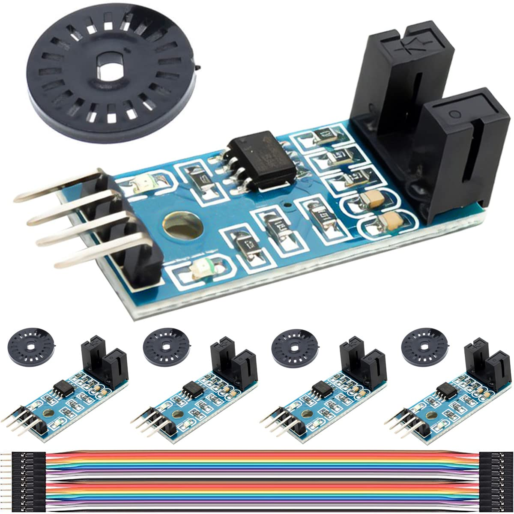
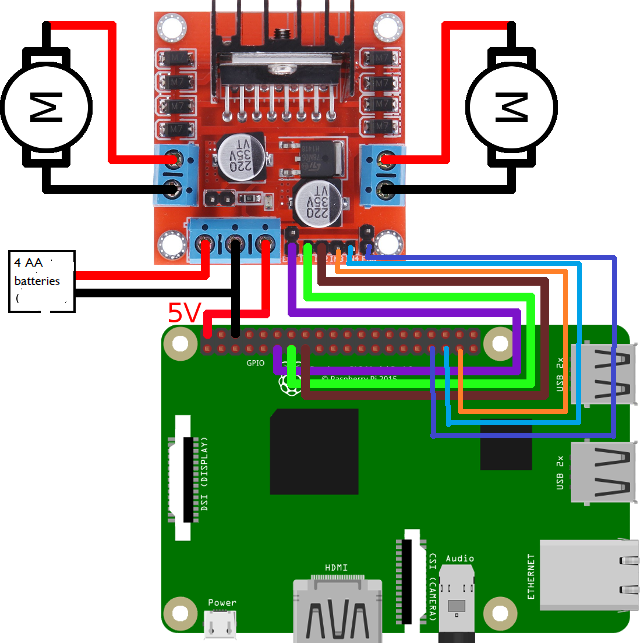
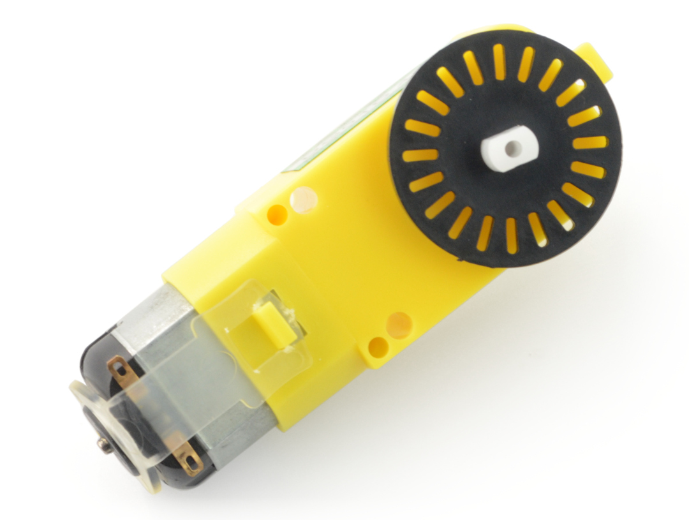
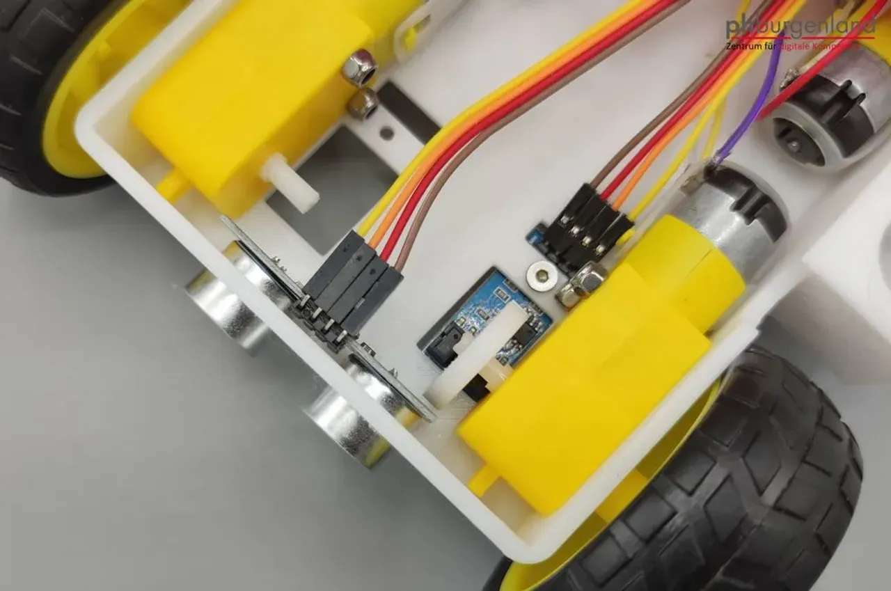
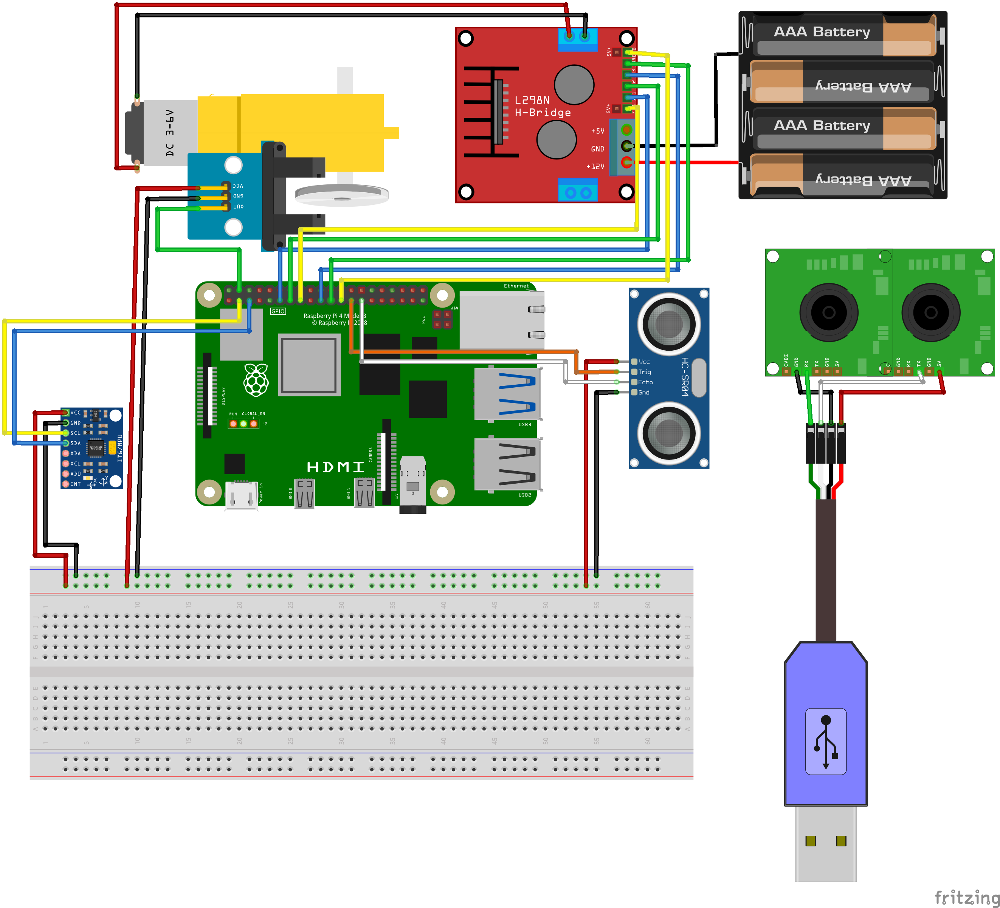

# 🛠️Assembly guide of the robot
This file aims to provide a step-by-step guide of how to build the robot.

## 💡Components
First, we will take a look at all the components and its functions.

### 1. Chassis & motors
The chosen one is a commonly used structure, particularly well-known for learner robotics projects. It consists on four wheels attached to one DC motor each in differential-drive structure, connected to a solid base structure divided in two layers.

Further information about the DC motors can be found in the [docs/hardware](docs/hardware/) folder.
The power requirement of each motor ranges from 3 to 6 V. The four motors are connected in parallel, so a 6 V supply is sufficient to power all of them simultaneously. This voltage is provided by four AA batteries connected in series.

It is necessary a device to control all the motors, which is called a driver. This device receive some inputs and sends a PWM signal to each motor. In this case, the device is the L298N motor driver. Its datasheet is attached in the [docs/hardware](docs/hardware/) folder.

### 2. Processor
As a processor, we will use a Raspberry Pi 4 Model B with 8GB RAM.  It runs all the code and connects to the electronic components. More information about the Raspberry Pi can be found on its [official webpage](https://www.raspberrypi.com/products/raspberry-pi-4-model-b/).

Here is attached a diagram with all its pins which will be used later for wiring.

### 3. Camera
In the project, I use a stereo camera to estimate depth. There are two main types of cameras that work with Rasperry Pi boards:
- Raspberry Pi cameras
- USB cameras

I used finally a USB camera due to its lower cost. The model is [GXIVISION LSM22100](https://www.ebay.es/itm/355022303029)

### 4. Accelerometer & Gyroscope
In order to get a pose estimation, it is necessary a sensor of this kind to get an approximation of the robot's orientation. The sensor used is the MPU-6050, more specifically I will be using its gyroscope. You can find more information about this sensor in the [docs/hardware](docs/hardware/) folder.

It sends its measurements via I2C so you will need to connect it to SDA and SCL pins in the Raspberry. However, thanks to the [MPU6050](https://pypi.org/project/mpu6050/) library for Python.

### 5. Encoders
Encoders are used to measure the speed of each wheel. These devices are placed near the wheels and estimate their velocity with high precision based on physical effects. There are various types, such as optical and magnetic encoders. In this project I have used an optical encoder called **LM-393**. Again, its datasheet is located in the [docs/hardware](docs/hardware/) folder. 

### 6. Ultrasonic sensor
Ultrasonic sensors are widely used distance sensors in mobile robotics, primarily for collision avoidance. In this project, the ultrasonic sensor acts as a secondary safeguard, helping to prevent collisions that might be missed by the LLM. The most commonly used ultrasonic sensor—and the one chosen for this project—is the HC-SR04, whose datasheet is in the [docs/hardware](docs/hardware/) folder. 

### 7. Power bank
To power the Raspberry Pi and its connected components, a separate power supply is needed in addition to the one used for the motors. Due to the mobile nature of the robot, a power bank is a practical choice since it doesn't need to be plugged into an outlet. The power bank must meet the Raspberry Pi's power requirements, which are 5V and 3A. There are many suitable models available on the market. 

## 🛠️Assembly
These are the instructions to build the robot.

1. **Build the chassis** and place the Raspberry Pi 4 in the lower layer. It will be necessary to weld a black and a red wire to the power pins of each motor.
2. **Connect the L298N** to its power supply, like in the image below.

You can use the following Raspberry Pi pins:

| Pin Name | GPIO | Description                 |
|----------|------|-----------------------------|
| IN1      | 17   | Left motor control pin      |
| IN2      | 27   | Left motor control pin      |
| IN3      | 10   | Right motor control pin     |
| IN4      | 9    | Right motor control pin     |
| ENA      | 4    | Enable pin for left motor   |
| ENB      | 22   | Enable pin for right motor  |

3. **Mount the encoder disks on each wheel edge**, as shown in the image.

4. **Mount and connect the encoders to the Raspberry Pi**, paying attention to leave the disk in the gap between the two sides of the encoder.

The suggested pins are 11, 18, 19 and 26 for the 4 encoders.

5. **Connect the MPU-6050** and place it in a place where it's not moving.

6. **Connect the ultrasonic sensor**. It will require two pins apart from the power: one for echo and one for trigger. For example, use the GPIO pin 20 for trigger and 21 for echo.
7. **Connect the camera** via USB.
8. Once all above is done, **connect the power bank** to the Raspberry Pi Power Input and supply the protoboard with +5V and GND.

The schematic should look like the image below.

