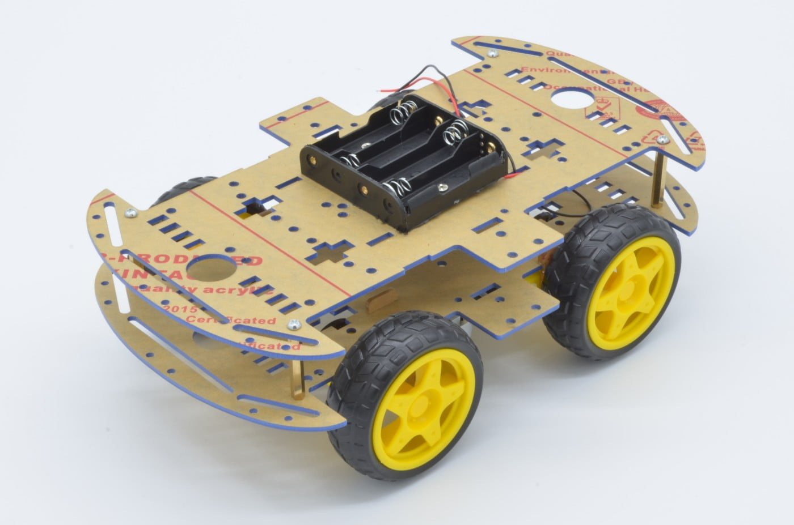
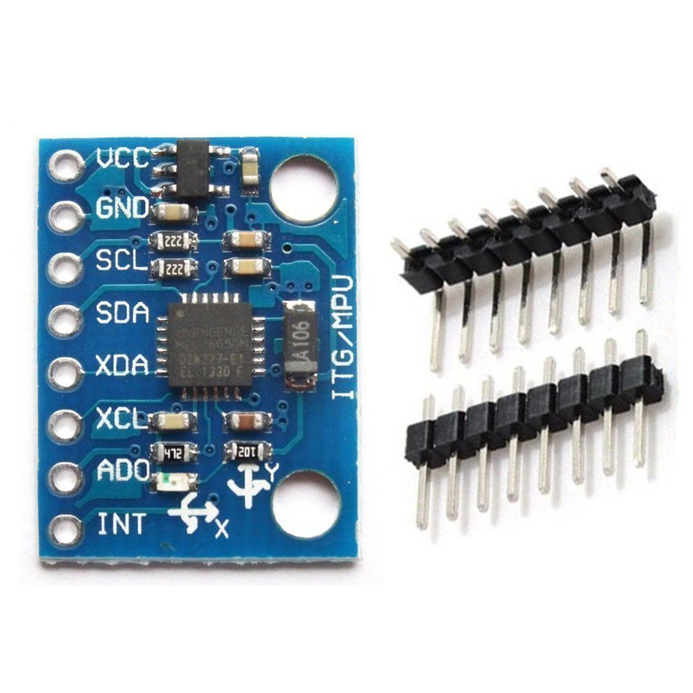
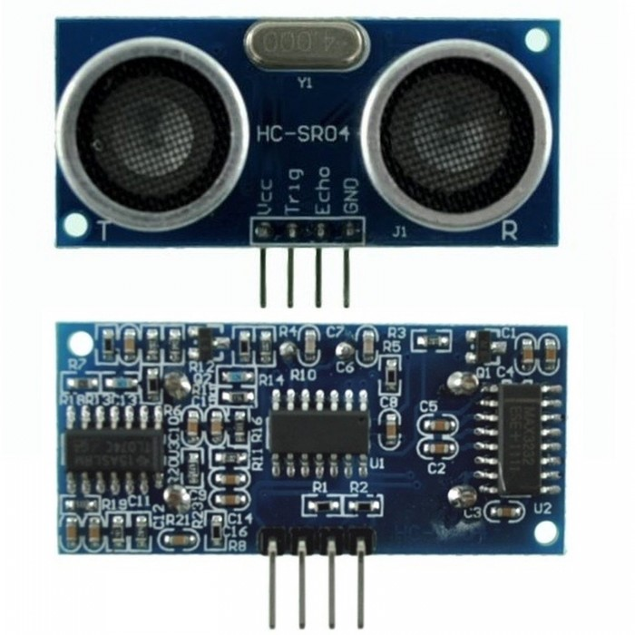

# Assembly guide of the robot
This file aims to provide a step-by-step guide of how to build the robot.

## Components
First, we will take a look at all the components and its functions.

### 1. Chassis & motors
The chosen one is a commonly used structure, particularly well-known for learner robotics projects. It consists on four wheels attached to one DC motor each in differential-drive structure, connected to a solid base structure divided in two layers.

Further information about the DC motors can be found in the [docs/hardware](docs/hardware/) folder.
The power requirement of each motor ranges from 3 to 6 V. The four motors are connected in parallel, so a 6 V supply is sufficient to power all of them simultaneously. This voltage is provided by four AA batteries connected in series.

It is necessary a device to control all the motors, which is called a driver. This device receive some inputs and sends a PWM signal to each motor. In this case, the device is the L298N motor driver. Its datasheet is attached in the [docs/hardware](docs/hardware/) folder.

### 2. Processor
As a processor, we will use a Raspberry Pi 4 Model B with 8GB RAM.  It runs all the code and connects to the electronic components. More information about the Raspberry Pi can be found on its [official webpage](https://www.raspberrypi.com/products/raspberry-pi-4-model-b/).

Here is attached a diagram with all its pins which will be used later for wiring.

### 3. Camera
In the project, I use a stereo camera to estimate depth. There are two main types of cameras that work with Rasperry Pi boards:
- Raspberry Pi cameras
- USB cameras

I used finally a USB camera due to its lower cost. The model is [GXIVISION LSM22100](https://www.ebay.es/itm/355022303029)

### 4. Accelerometer & Gyroscope
In order to get a pose estimation, it is necessary a sensor of this kind to get an approximation of the robot's orientation. The sensor used is the MPU-6050, more specifically I will be using its gyroscope. You can find more information about this sensor in the [docs/hardware](docs/hardware/) folder.

It sends its measurements via I2C so you will need to connect it to SDA and SCL pins in the Raspberry. However, thanks to the [MPU6050](https://pypi.org/project/mpu6050/) library for Python.

### 5. Encoders
Encoders are needed to measure the speed. This is a device placed near each wheel that can estimate with high precision its velocity based on some physical effect. There are optical encoders, magnetic... In this project I have used an optical encoder called **LM-393**. Again, its datasheet is located in the [docs/hardware](docs/hardware/) folder. 

### 6. Ultrasonic sensor
Ultrasonic sensors are a very well-known distance sensor which are used in the field of mobile robotics mostly to avoid collisions. It will work as a double-check to avoid a possible collision that has been ignored by the LLM. The most famous ultrasonic sensor and the one used for this project is the HC-SR04, whose datasheet is in the [docs/hardware](docs/hardware/) folder. 

### 7. Power bank
To power the Raspberry Pi with all its components it is necessary a power supply apart from the motor's one, as seen before. Because of the kind of application it is very useful a PowerBank since it doesn't need to be connected to the current. This PowerBank must meet the Power Supply Requirements of the Raspberry Pi, which are basicly 5V and 3A. There are a lot of options available.

